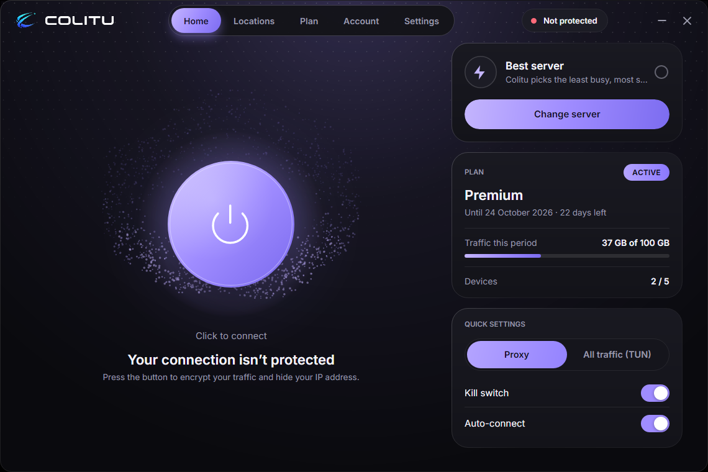
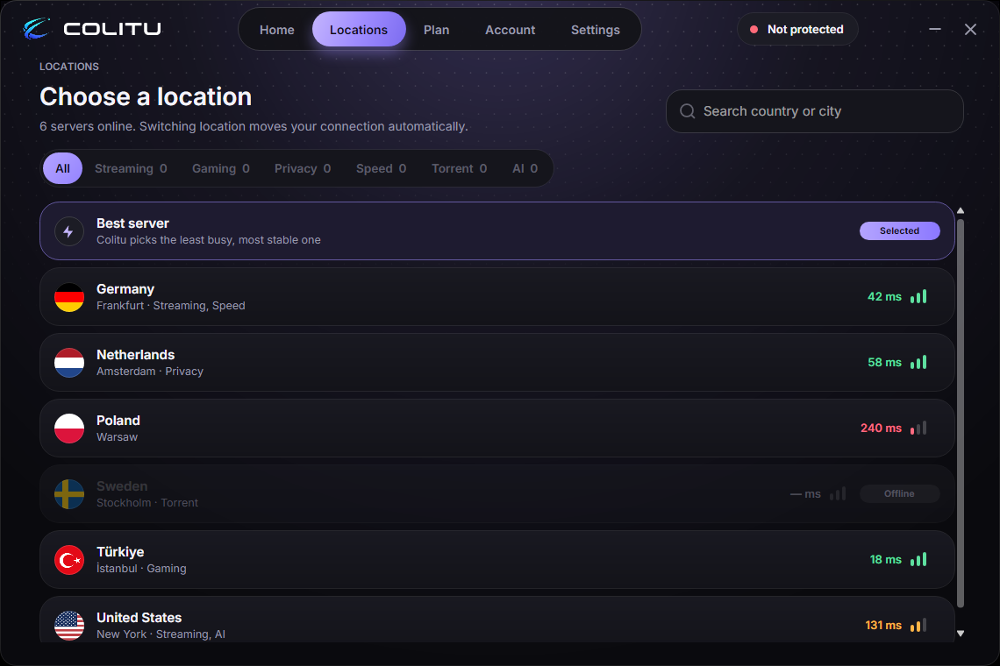
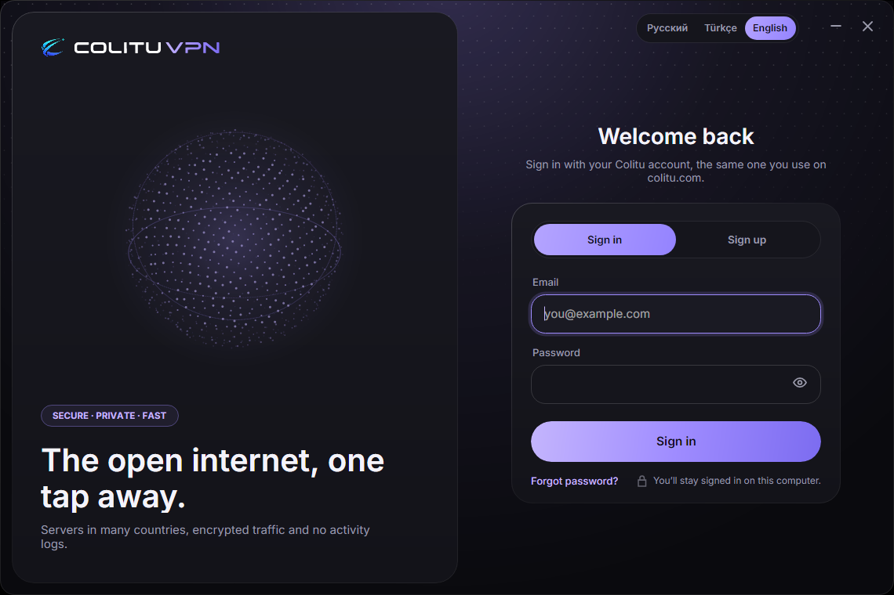
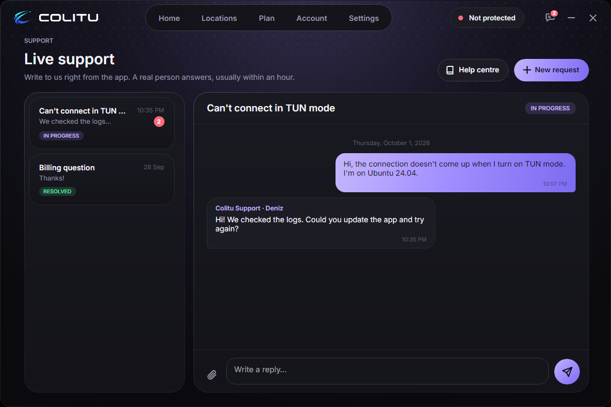

# Colitu VPN for Linux

[](https://github.com/colitu/colitu-linux/actions/workflows/test.yml)
[](https://github.com/colitu/colitu-linux/releases/latest)
[](LICENSE)
[](https://status.colitu.com)

The open-source Linux desktop client of [Colitu VPN](https://colitu.com). A
single native window handles the account, locations and connection through the
Colitu API; underneath, a core layer runs Xray and sing-box and manages the
system proxy, TUN, routing and DNS. It shares that core layer with the
[Windows client](https://github.com/cyberlexs/colitu-windows).

| | |
|---|---|
| App | `Colitu VPN` (`/opt/colitu-vpn/ColituVPN`, launcher `colitu-vpn`), Avalonia on .NET 10 |
| Version | `1.0.0` (`src/ColituVPN/ColituVPN.csproj`) |
| OS | Debian/Ubuntu/Mint (`.deb`), Fedora/RHEL/openSUSE (`.rpm`), any distribution (`.tar.gz`); x64 and arm64 |
| Languages | Russian, English, Turkish |
| License | [GPL-3.0](LICENSE) |

<p align="center">
  
  
  
  
</p>

**Download:** [colitu.com/download/linux](https://colitu.com/download/linux) · [Releases](../../releases)

> A Colitu account is required to connect. The app has no hard-coded servers:
> the server list and connection profiles are issued per device by the Colitu API.

## Features

- **Automatic protocol selection.** Hysteria2 runs on the bundled sing-box core;
  VLESS Reality, VLESS XHTTP, Trojan and Shadowsocks on Xray. Candidates are
  tried in order until traffic actually flows, and the result is reported back
  to the panel.
- **Proxy and TUN modes.** Proxy mode sets the desktop's system proxy (GNOME,
  KDE) and needs no extra rights. TUN mode sends all traffic through the tunnel;
  it runs the core as root through `sudo`, so the app asks for the
  sudo password once per run and keeps it in memory only.
- **Kill switch** on nftables (TUN mode). While it is on, only loopback, the
  tunnel, the local network, DHCP, the VPN servers and the Colitu API can be
  reached. A root watcher removes the rules as soon as the app exits, so a crash
  never leaves the computer offline.
- **Ad blocking** (optional): DNS through Colitu's ad-blocking servers, the same as on the phones and Windows.
- **One window for everything:** sign-in and registration, e-mail
  verification, password reset, locations with live pings, plan, account and
  devices, and live support with attachments.
- **Private local data.** Sessions and cached connection settings are
  AES-GCM encrypted with a key bound to the machine id and the user, and the
  data folder (`~/.local/share/ColituVPN`) is readable by its owner only. Core
  logs never record the sites a user visits.
- **Verified updates.** `downloads/linux/latest.json` is signed offline with the
  Colitu release key (ECDSA P-256); the matching `.deb`/`.rpm` is checked
  against the signed SHA-256 and installed with `pkexec`.

## Layout

| Path | Contents |
|---|---|
| `src/ColituVPN/Views/ColituMainWindow*` | the Colitu window (sign-in, home, locations, plan, account, settings, support) |
| `src/ColituVPN/Services/Colitu*` | API, session, VPN, kill switch, updates, support, localization |
| `src/ColituVPN/Assets/Colitu` | theme, fonts, logo and flags |
| `src/ServiceLib` | core layer: config generation, routing, DNS, core processes |
| `src/ColituVPN.Tests`, `src/ServiceLib.Tests` | tests |
| `package-debian.sh`, `package-rhel.sh` | packages |
| `scripts/sign-linux-manifest.ps1` | signs the update manifest |

## Build

Requires the .NET 10 SDK.

```sh
cd src
dotnet publish ColituVPN/ColituVPN.csproj -c Release -r linux-x64 -p:SelfContained=true -o ../out/linux-x64
dotnet test --project ColituVPN.Tests
```

The ad-blocking DNS servers are Colitu's own nodes and are not in the source;
release builds pass them in the `ColituAdBlockDoh` environment variable (the
package scripts read `COLITU_ADBLOCK_DOH`). Without them the ad-block switch is hidden.

## Release

1. Set the version in `src/ColituVPN/ColituVPN.csproj`.
2. Push a tag `vX.Y.Z`. The `Release Linux` workflow tests, publishes x64 and
   arm64, packages `.deb`, `.rpm` and `.tar.gz` (`scripts/package-linux.sh`) and attaches them with `SHA256SUMS` to
   the GitHub release. The ad-block DNS list comes from the `COLITU_ADBLOCK_DOH`
   repository secret.
3. Sign the update manifest offline (PowerShell 7, release key outside the repository):
   `pwsh scripts/sign-linux-manifest.ps1 -Version X.Y.Z -DebPath <amd64.deb> -RpmPath <x86_64.rpm>`
4. Upload the packages and `latest.json` from `release-linux/` to the
   website's `downloads/linux/` folder.

`package-debian.sh` and `package-rhel.sh` build the same packages on a Debian or
RHEL-family machine without CI.

## Install

Debian, Ubuntu, Linux Mint, Pop!_OS:

```sh
sudo apt install ./colitu-vpn_X.Y.Z_amd64.deb
```

Fedora, RHEL, Rocky, AlmaLinux, openSUSE:

```sh
sudo dnf install ./colitu-vpn-X.Y.Z-1.x86_64.rpm
```

Any other distribution: unpack `colitu-vpn-X.Y.Z-linux-x64.tar.gz` and run
`./ColituVPN`. TUN mode and the kill switch need `sudo` and `nftables`.

## License

Colitu VPN for Linux is distributed under the
[GNU General Public License v3.0](LICENSE). It includes open-source components
that keep their own licenses; Xray-core (MPL-2.0) and sing-box (GPL-3.0) are
bundled as separate programs. See [NOTICE](NOTICE) for the full list.

The "Colitu" name and logo are trademarks of Colitu and are not covered by the
GPL. If you redistribute a modified version, please use your own name and
branding.
